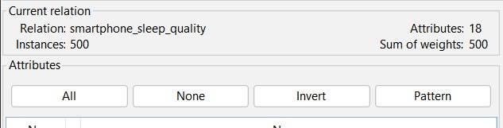

# Verificação e Análise Exploratória do Dataset
---
## Etapa 1: Verificação da estrutura do dataset
**Objetivo:** Verificar se o conjunto de dados foi carregado corretamente no Weka e se sua estrutura está adequada para a tarefa de classificação.  
**Resultado:** O dataset foi carregado corretamente no Weka, sem erros de importação. A base possui 500 instâncias e 18 atributos, atendendo aos requisitos mínimos do trabalho. A classe-alvo definida foi `qualidade_sono`, com duas categorias: `bom` e `ruim`.

| Verificação           | Resultado observado          | Situação |
| --------------------- | ---------------------------- | -------- |
| Carregamento no Weka  | O arquivo abriu corretamente | Atendido |
| Número de instâncias  | 500 registros                | Atendido |
| Número de atributos   | 18 atributos                 | Atendido |
| Classe-alvo           | `qualidade_sono`             | Atendido |
| Tipo da classe        | Nominal                      | Atendido |
| Tarefa de aprendizado | Classificação                | Atendido |

---
## Etapa 2: Verificar os atributos e a classe-alvo

**Objetivo:** Verificar a distribuição da variável que será prevista pelo modelo de classificação.

**Resultado:** A classe-alvo do dataset é `qualidade_sono`, composta por duas categorias: `bom` e `ruim`. A distribuição encontrada foi de 291 registros classificados como `ruim` e 209 registros classificados como `bom`.

| Classe | Quantidade | Interpretação                                                                                  |
| ------ | ---------- | ---------------------------------------------------------------------------------------------- |
| ruim   | 291        | Maior quantidade de registros, indicando predominância de usuários com pior qualidade do sono. |
| bom    | 209        | Menor quantidade, mas ainda com representatividade suficiente.                                 |

---
## Etapa 3: Analisar estatísticas básicas dos atributos numéricos

**Objetivo:** Observar o comportamento geral dos atributos numéricos, identificando faixas de valores, dispersão e possíveis inconsistências.

| Atributo                | Mínimo | Máximo | Média aproximada | Observação                                                          |
| ----------------------- | ------ | ------ | ---------------- | ------------------------------------------------------------------- |
| `idade`                 | -10    | 200    | 29,68            | Possui valores inconsistentes, como idades negativas e muito altas. |
| `horas_uso_diario`      | 2      | 30     | 7,71             | Possui valores muito altos, indicando possíveis outliers.           |
| `tempo_redes_sociais`   | 0,5    | 17     | 3,73             | Possui valores faltantes e alguns valores elevados.                 |
| `horas_sono`            | -1,4   | 9      | 6,09             | Possui valores impossíveis, como horas negativas.                   |
| `nivel_estresse`        | 2      | 9,9    | 6,43             | Faixa plausível para escala de estresse.                            |
| `consumo_energia`       | 1      | 9      | 5,42             | Valores dentro de uma escala controlada.                            |
| `despertares_noturnos`  | -3     | 15     | 2,25             | Possui valores impossíveis, como quantidade negativa.               |
| `notificacoes_diarias`  | 20     | 1200   | 239,37           | Possui valores muito altos, indicando outliers.                     |
| `luminosidade_ambiente` | 110,8  | 771,5  | 416,48           | Variação plausível, mas com valores altos.                          |

**Análise:** A análise estatística inicial mostrou que alguns atributos possuem comportamento coerente com o domínio, como `nivel_estresse`, `consumo_energia` e `luminosidade_ambiente`. No entanto, também foram encontrados valores inconsistentes ou extremos em atributos como `idade`, `horas_sono`, `despertares_noturnos`, `horas_uso_diario` e `notificacoes_diarias`.

**Evidencias Weka**
Figura - Atributo idade

Figura - Atributo Horas Sono

Figura - Atributo Notificações Diarias

Figura - Atributo Qualidade Sono

---
## Etapa 4: Identificar valores faltantes

**Objetivo:** Identificar os atributos com valores ausentes e levantar hipóteses para o tratamento posterior no pré-processamento.

**Resultado:** Foram encontrados valores faltantes em atributos relevantes para o problema de classificação da qualidade do sono.

| Atributo               | Quantidade de valores faltantes | Possível impacto                                                 |
| ---------------------- | ------------------------------- | ---------------------------------------------------------------- |
| `tempo_redes_sociais`  | 35                              | Pode afetar a análise do uso do smartphone em redes sociais.     |
| `horas_sono`           | 29                              | Impacta diretamente a análise da qualidade do sono.              |
| `notificacoes_diarias` | 40                              | Pode influenciar a relação entre interrupções digitais e sono.   |
| `atividade_fisica`     | 30                              | Pode afetar a análise de hábitos saudáveis relacionados ao sono. |

**Análise:** Os valores faltantes aparecem em atributos importantes para o domínio do problema. O atributo `horas_sono`, por exemplo, tem relação direta com a qualidade do sono, enquanto `tempo_redes_sociais` e `notificacoes_diarias` representam aspectos do uso do smartphone. Dessa forma, os valores faltantes não devem ser ignorados na etapa seguinte, pois aparecem em atributos relevantes para o problema.

Como decisão futura para o pré-processamento, poderemos utilizar o filtro `ReplaceMissingValues` do Weka. Para atributos numéricos, como `horas_sono`, `tempo_redes_sociais` e `notificacoes_diarias`, poderá ser considerada a substituição por média ou mediana. Para o atributo nominal `atividade_fisica`, poderá ser considerada a substituição pela moda.

Figura - Atributo Tempo em Redes Sociais

Figura - Atributo Horas de Sono

Figura - Atributo Notificação Diarias

Figura - Atributo Atividade Física

---

## Etapa 5: Identificar inconsistências, ruídos e outliers

**Objetivo:** Identificar valores fora do padrão, inconsistências e possíveis outliers presentes no dataset antes da etapa de pré-processamento.

**Inconsistências encontradas:**

| Atributo               | Problema observado                       | Interpretação                                                                    |
| ---------------------- | ---------------------------------------- | -------------------------------------------------------------------------------- |
| `idade`                | Valores como -10, -5, -1, 130, 150 e 200 | Idades negativas ou muito elevadas são inconsistentes para o domínio.            |
| `horas_sono`           | Valores como -1,4 e 0                    | Quantidade negativa de sono é impossível e zero horas pode indicar caso extremo. |
| `despertares_noturnos` | Valores como -3                          | Não é possível ter quantidade negativa de despertares.                           |
| `horas_uso_diario`     | Valores como 25, 28 e 30                 | Representam outliers, pois ultrapassam ou se aproximam do limite diário real.    |
| `notificacoes_diarias` | Valores como 650, 792, 1000 e 1200       | Indicam comportamento extremo de uso do smartphone.                              |

Nesta análise, foram diferenciados dois tipos de problemas. As **inconsistências** correspondem a valores impossíveis no domínio real, como idade negativa, horas de sono negativas e quantidade negativa de despertares noturnos. Já os **outliers** correspondem a valores extremos que podem representar comportamento atípico, mas ainda possível, como muitas horas de uso diário do smartphone ou um número muito elevado de notificações.

**Análise:** Foram identificados valores inconsistentes e outliers em alguns atributos. As inconsistências mais evidentes aparecem em `idade`, `horas_sono` e `despertares_noturnos`, pois possuem valores impossíveis dentro do domínio real. Já atributos como `horas_uso_diario` e `notificacoes_diarias` apresentam valores extremos, que podem representar tanto erros inseridos no dataset quanto usuários com comportamento muito fora do padrão.

Esses achados indicam que, no pré-processamento, a equipe deverá tratar os valores impossíveis de forma mais rígida, por meio de correção, substituição ou remoção. Já os outliers deverão ser avaliados com mais cuidado, pois alguns podem representar comportamentos relevantes para o problema de uso excessivo de smartphone.

Figura - Atributo Despertar Noturno

---

## Etapa 6: Observar relações entre atributos

**Objetivo:** Observar possíveis relações entre os atributos de entrada e a classe-alvo `qualidade_sono`.

**Relações observadas:** Foram analisadas relações entre atributos ligados ao uso do smartphone, hábitos de sono e a classe-alvo. Os principais atributos observados foram `horas_uso_diario`, `uso_madrugada`, `horas_sono`, `nivel_estresse` e `notificacoes_diarias`.

| Relação analisada                         | Interpretação esperada                                                                       |
| ----------------------------------------- | -------------------------------------------------------------------------------------------- |
| `horas_uso_diario` × `qualidade_sono`     | Usuários com maior tempo de uso diário tendem a apresentar maior chance de sono ruim.        |
| `uso_madrugada` × `qualidade_sono`        | O uso do smartphone durante a madrugada pode estar associado à pior qualidade do sono.       |
| `horas_sono` × `qualidade_sono`           | Menor quantidade de horas de sono tende a se relacionar com a classe `ruim`.                 |
| `nivel_estresse` × `qualidade_sono`       | Níveis mais altos de estresse podem aparecer com maior frequência em usuários com sono ruim. |
| `notificacoes_diarias` × `qualidade_sono` | Muitas notificações podem indicar maior interrupção e maior exposição ao smartphone.         |

**Análise:** As relações observadas são coerentes com o domínio do problema. A qualidade do sono não parece depender de apenas um atributo isolado, mas de uma combinação de fatores, como tempo de uso do smartphone, uso durante a madrugada, quantidade de horas dormidas, notificações recebidas e nível de estresse.

Nas visualizações realizadas no Weka, a classe `qualidade_sono` foi utilizada como atributo de cor — pontos **azuis** representam registros classificados como `bom`, enquanto pontos **vermelhos** representam registros classificados como `ruim`. Essa configuração permitiu observar visualmente como os atributos de entrada se distribuem em relação à classe-alvo.

Figura - Relação entre horas_sono e horas_uso_diario, com cor por qualidade_sono

Figura - Relação entre horas_sono e uso_madrugada, com cor por qualidade_sono

Figura - Relação entre horas_sono e nivel_estresse, com cor por qualidade_sono

Figura - Relação entre horas_sono e notificacoes_diarias, com cor por qualidade_sono

---
## Conclusão do Teste Piloto

O teste piloto permitiu verificar que o dataset foi carregado corretamente no Weka e possui estrutura adequada para a tarefa de classificação. A base contém 500 instâncias, 18 atributos e a classe-alvo `qualidade_sono`, composta pelas categorias `bom` e `ruim`.

A análise exploratória inicial mostrou que o dataset possui atributos relevantes para o problema, como tempo de uso diário do smartphone, uso durante a madrugada, horas de sono, nível de estresse, notificações diárias e despertares noturnos. Também foram identificados valores faltantes, inconsistências e outliers, principalmente nos atributos `idade`, `horas_sono`, `despertares_noturnos`, `horas_uso_diario` e `notificacoes_diarias`.

Com base nesses achados, conclui-se que o pré-processamento será necessário, mas deverá ser guiado pelas evidências observadas. As principais ações futuras serão o tratamento de valores faltantes, a correção ou remoção de valores impossíveis, a análise dos outliers e a possível avaliação de atributos irrelevantes, como `modelo_dispositivo`, que pode não contribuir diretamente para a classificação da qualidade do sono.

Portanto, o teste piloto cumpriu sua função de orientar as próximas decisões do projeto, evitando que o pré-processamento seja aplicado de forma mecânica. As correções e transformações futuras deverão ser baseadas nas evidências observadas nesta análise inicial.
